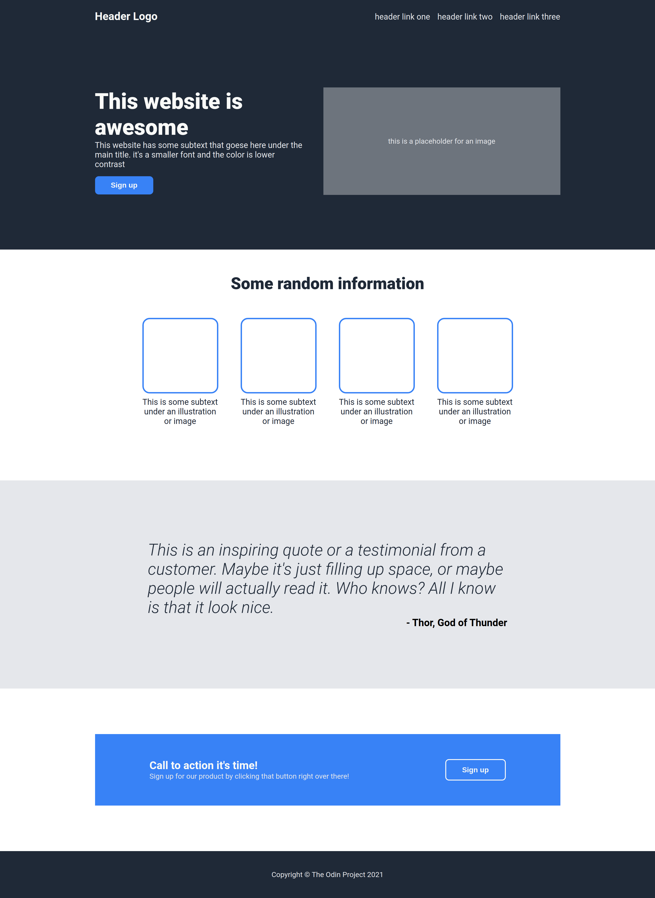

# Landing Page

This is a project provided by [@theodinproject](https://www.theodinproject.com/). It was offered at the end of the flexbox lesson.
- The assignement can be found [here](https://www.theodinproject.com/lessons/foundations-landing-page)

## What I've learned
Thanks to this project I became more comfortable working with flexbox.